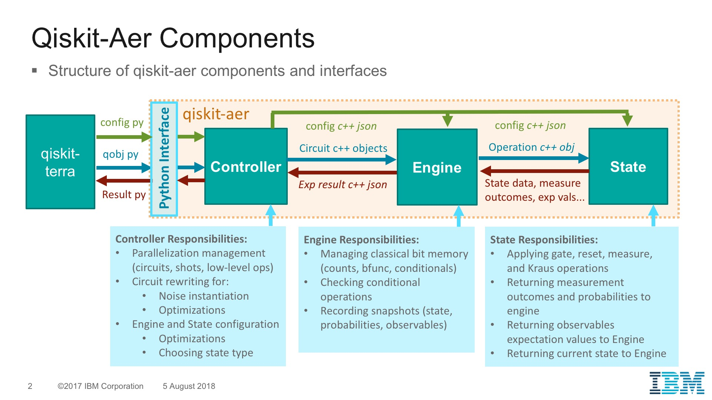

# Qiskit-Aer

## Repository contents

* The  **aer** folder contains the Qiskit-Aer python module for use with Qiskit-Terra.
* The **src** folder contains the C++ and Cython source files for building the simulator.
* The **examples** folder contains example qobj files for the simulator.
* The **legacy-build** folder contains a stand-alone executable build that can be used for development and testing. Note that stand-alone building will be removed before release and will not be supported.

---

# Documentation 

* **Authors:** Christopher J. Wood
* **Last Updated:** 22.08.2018

## Table of Contents
    
* [Introduction](#introduction)
    * [Installation](#installation)
* [Components](#components)
    * [Implementation](#implementation)
    * [Parallelization](#parallelization)
* [Noise models](#noise-models)
    * [Applying Error Models](#applying-error-models)
    * [Error types](#error-types)
        * [Unitary Error](#unitary-error)
        * [Reset Error](#reset-error)
        * [Kraus Error](#kraus-error)
        * [Readout Error](#readout-error)
    * [X90 Error Decompositions](#x90-error-decompositions)
    * [Building a Noise Model](#building-a-noise-model)
* [Supported Instructions](#supported-instructions)
    * [Standard Operations](#standard-operations)
        * [Measure](#measure)
        * [Reset](#reset)
        * [Boolean Function](#boolean-function)
        * [Standard Gates](#standard-gates)
    * [Extension Operations](#extension-operations)
        * [Matrix Multiplication](#matrix-multiplication)
        * [Snapshots](#snapshots)
        * [Noise switch](#noise-switch)
        * [Kraus Error Operation](#kraus-error-operation)
        * [Readout Error Operation](#readout-error-operation)

---

## Introduction

This is a working draft for the Qiskit-Aer simulator framework for Qiskit-Terra. This is the development repository and has no guarantee of stability or correctness.

### Installation

Installation of the simulator may be done by running

```bash
python setup.py built_ext --inplace
```

The simulator backend may then be imported into qiskit using

```python
from aer.aer_simulator import AerSimulator

backend = AerSimulator()
```

This has only been tested with Anaconda builds of Numpy and Scipy which include the Intel MKL BLAS and OpenMP libraries.

---

## Components

Qiskit-Aer has three core components: The controller, the engine, and the state as summarized in the following figure.



The Qiskit-Aer backed in Qiskit-Terra interfaces to the C++ simulator Controller through a Cython wrapper. The controller handles high-level management of circuit optimization and execution, noise model sampling, and parallelization. The Engine manages evaluation of individual circuits on a State class and collects all output data including measurement outcomes and snapshots. The *State* class manages the base data-type for the quantum state and updates of this state based on circuit operations.

[Back to top](#table-of-contents)

### Implementation

The typical runtime of the simulator is as follows:

##### Controller

* An execute command in Qiskit-terra sends a serialized qobj JSON to the Aer simulator cython wrapper
* The wrapper deserializes the JSON and the resulting object is loaded by the *Controller*
* For each circuit in the QOBJ the controller sends the circuit to the Engine class for execution and collects the *Engine* result data for that circuit.
* If a noise model is present, the controller will sample an independent noisy implementation of the circuit for each shot, and send each single-shot noisy circuit to the *Engine* to be evaluated and collect the combined results.
* Optionally additional circuit level optimizations may be applied to the circuit before sending to the *Engine* for execution.

##### Engine

* The *Engine* recieves a quantum circuit to be evaluated for a specified number of shots.
* For each shot the *Engine*:
    1. Initializes all classical registers in the 0 state
    1. Initializes the *State* class in its initial state.
    1. Applies each operation in the circuit sequentially according to:
        1. If the operation is a circuit operation (gate, reset, matrix, kraus) it checks if the operation passes a conditional check.
        1. If the conditional check passes (if it is a non-conditional operation it will always pass) it sends the operation to the *State* class for execution.
        1. If the operation is a measure or measure sampling operation it sends the operation to the *State* class for execution, and obtains the measurement outcome from the *State* class.
        1. If the operation is a Snapshot the *Engine* executes the snapshot instruction based on the current state of the *State* class, without changing the *State*.
        1. If the operation is a *bfunc* it applies the function based on its current classical register states.

###### State

* The *State* class applies each operation received by the *Engine*. If it does not recognize the operation it throws an error which will be reported in the output. Whether operations are supported may be checked in advance before execution of any operations in a circuit.

[Back to top](#table-of-contents)

### Parallelization

The simulator supports parallel CPU processing using the OpenMP library. Currently parallelization can happen at three levels:
    
1. Parallel execution of multiple circuits
1. Parallel execution of shots for a single circuit
1. Parallelization of the operations implemented by the *State* class

Parallel circuit and shot may only be used one at a time, not simultaneously. Thread management for these different processes can be handled by config settings.

[Back to top](#table-of-contents)

---

## Noise Model

Noise is handled by inserting additional operations into a circuit to implement the noise. There are two types of noise process:
1. Noise that is *independent* of the current state of the system (*[Unitary](#unitary-error), [Reset](#reset-error)*)
2. Noise that is *dependent* on the current state of the system (*[Readout](#readout-error), [Kraus](#kraus-error)*)

The *Type 1* noises can be inserted into a circuit by *sampling* a given realization of the noise for each operation in the circuit from a noise model. This may lead to a single circuit operation sequence being modified into many different sequences for each realization of noise. Note that we do not need additional operator types to describe these noise processes --- the operators inserted to realize the noise are [standard gates](#standard-gates), [matrix multiplication](#matrix-multiplication), and [reset](#reset) operations.

The *Type 2* noise processes cannot be sampled to choose a realization independent of the state of the system. This is because the probabilities for the classical bit-flip error for readout error, and the probabilities of choosing an individual operator to apply for Kraus error, depend on the current state classical or quantum state respectively.  Hence, we need to define new types of operators for these noise processes which direct the State or Engine to sample from the possible noise realizations conditional on the current quantum or classical simulation state respectively.


### Applying Error Models

A noise model consists of a table of [Error types](#error-types) assigned to a labeled circuit operation. We may assign errors to any labeled operation in our circuit. Typically these will be named gates (eg. `"x"`, `"u3"`, `"cx"`, etc), `"measure`" and `"reset`", or labeled arbitrary [unitary gates](#matrix-multiplication) (eg. `"noisy-gate`"), and each label may be assigned multiple errors. All errors must be assigned to one of three different error models:

1. *Indexed local error model:* An error that applies when a specific gate is applied to a specific qubit(s), and the error acts only on those qubit(s) participating in the gate.
2. *Default local error model:* An error that applies when a specific gate is applied to any qubit(s), and the error acts only on those qubit(s) participating in the gate.
3. *Indexed non-local error model:* An error that applies when a specific gate is applied to a specific qubit(s), and the error may act on any subset of qubits.

Note that indexed and default local error models are exclusive. If an indexed model is defined for an operation the default will be ignored. If an indexed local error model is not defined however, the default will be applied as a default fallback. Multiple Error types can be added for each error model type and will be applied in the order they are added. For example we could add a Unitary Error, a reset error, followed by a second unitary error to model relaxation in an arbitrary basis.

The flow for searching for an error model to sample is as follows: Suppose we are applying a gate labeled `"noisy-gate"`

* Check for an indexed local error model for `"noisy-gate"`.
    * If an indexed local error model is found sample from each error in the error model.
    * If an indexed local error model is not found search for a default local error model for `"noisy-gate"`.
        * If a default local error model is found sample from each error in the error model.
* Check for an indexed non-local error model for `"noisy-gate"`.
    * If an indexed non-local error model is found sample from each error in the error model.

[Back to top](#table-of-contents)


### Error Types

Error types may be made derived from an `AbstractError` base type which requires a method to sample realizations of the error type and return them as a list of circuit operations. The currently supported error types are Unitary, Reset, Kraus and Readout (TODO).

##### JSON Object

General errors may be expressed as a JSON object using the following base template, plus additional fields for the parameters of the given error type.

```
{
    "type": str
    "operations": list[str],
    "op_qubits": list[list[int]],  // optional
    "noise_qubits": list[list[int]]  // optional
}
```

Here the compulsory fields are the `"type"` field that labels the error type (eg. `"type": "unitary"`), and the `"operations"` field that specifies the circuit operations this error applies to (eg. to apply to all Pauli gates we could have `"operations": ["id", "x", "y", "z"]`). The optional fields are `"op_qubits"` and `"noise_qubit"`. If both these fields are present the error will be added as an *indexed non-local error*, if only `"op_qubits"` is present the error will be added as an *indexed local error*, and if neither are present the error will be added as a *default local error*. 

The `"op_qubits"` field specifies the indexed qubits this gate should be applied to. The sub-lists should be the same length as the number of qubits in the gate (Eg. to apply an error to a CNOT gate only when it has qubit-0 as control, and either qubit 1 or qubit 2 as target we could have `"op_qubits": [[0, 1], [0, 2]]`). For a non-local error the `"noise_qubits"` field specifies the qubits that the error should be applied to. Each sublist here should be the same length as the number of qubits in the noise operation, which for the non-local case need not be the same as the number of qubits in the original noisy gate.

#### Unitary Error

The most common error type for the simulator is a unitary error, which correspond to a mixed unitary error channel $$\mathcal{E}(\rho) = (1- \sum_j p_j) \rho + \sum_j p_j U_j \rho U_j^\dagger$$ where we have explicitly removed the identity term from the unitary operators. This is because we infer the probability of the identity operation from a list of probabilities $\{p_j\}$ by $p_I = 1 - \sum_j p_j$.

Note that this error type includes coherent errors (a single $U_0$ with $p_0=1$), and Pauli or Clifford errors. When this error is sampled from a single $U_j$ will be sampled from the distribution given by the their respective probabilities $\{p_j\}$.

##### JSON Object

The JSON object for specifying an error is given by

```
{
    "type": "unitary",
    "operations": list[str],
    "probabilities": list[double],
    "matrices": list[complex matrix]
    "op_qubits": list[list[int]], // optional
    "noise_qubits": list[list[int]] // optional
}
```

The additional parameter fields for unitary errors are `"matrices"` which is a list of unitary matrices for the error, and `"probabilities"` which is a list of probabilities for each matrix in matrices. The probabilities must sum to at most 1, if there sum is less than one the probability of an identity operation is inferred from the difference.

**Example:** *Completely depolarizing channel*
The following object implements a completely depolarizing channel on all single qubit gates `"u1", "u2", "u3"`

```json
{
    "type": "unitary",
    "operations": ["u1", "u2", "u3"],
    "probabilities": [0.25, 0.25, 0.25],
    "matrices": [
        [[[0, 0], [1, 0]], [[1, 0], [0, 0]]],
        [[[0, 0], [0, -1]], [[0, 1], [0, 0]]],
        [[[1, 0], [0, 0]], [[0, 0], [-1, 0]]]
    ]
}
```

##### Python Interface

**TODO:** We require a python interface for specifying these errors


#### Reset Error

Reset errors correspond to reset of a qubit to a Z-basis state with a given probability.

##### JSON Object

```
{
    "type": "reset",
    "probabilities": list[double]
}
```

**Example:** *single-qubit reset error*

Consider a reset error motivated by $T_1$ relaxation for a single qubit x90 gate with $t = 50$ ns gate time, $T_1 = 50$ microseconds relaxation time, and thermal population in the ground state of 100%. In this case the probability of reset to the ground state is $p_0 = 1 - exp(2\pi * 0.05 / 50) = 0.00626349$, the probability of reseting to the excited state is $p_1 = 0.$, and the probability of no reset is 0.993737. In this case the error object is given by

```json
{
    "type": "reset",
    "operations": ["x90"],
    "probabilities": [0.00626349, 0.0]
}
```


##### Python Interface

**TODO**


#### Kraus Error

Kraus errors correspond to a general CPTP noise channel expressed in the Kraus representation $$\mathcal{E}(\rho) = A_j \rho A_j^\dagger, \quad \sum_j A_j^\dagger A_j = I$$.

Note that when a Kraus error is loaded, if any of the Kraus operators are unitary or identity it will be partitioned into the equivalent noise channel $$\mathcal{E}(\rho) = (1-p_u - p_k)\rho + p_u \mathcal{U}(\rho) + p_k \mathcal{K}(\rho)A_j$$ where
$$\mathcal{U}(\rho) = \sum_j p_j U_j \rho U_j^\dagger, \quad \sum_j p_j = 1$$
$$\mathcal{K}(\rho) = \sum_j K_j \rho J_j^\dagger, \sum_j K_j^\dagger K_j = I$$
correspond are the unitary and non-unitary Kraus channels resulting from the original operators. Hence when sampling noise from a Kraus channel one of the the identity, unitary, or non-unitary component channels will be sampled based on the probabilities $\{1-p_u-p_k, p_u, p_k\}$.

##### JSON Object

The JSON object for specifying an error is given by

```
{
    "type": "kraus",
    "operations": list[str],
    "matrices": list[complex matrix]
    "op_qubits": list[list[int]], // optional
    "noise_qubits": list[list[int]] // optional
}
```

where `"matrices"` is a list of all the Kraus operators for a CPTP noise channel.

**Example:** *Amplitude damping channel*
The following object implements a single-qubit amplitude damping channel on all gates `"u1, "u2", "u3"` with damping parameter $\gamma = 1/4$:

```json
{
    "type": "kraus",
    "operations": ["u1", "u2", "u3"],
    "matrices": [
        [[[1, 0], [0, 0]], [[0, 0], [0.5, 0]]],
        [[[0, 0], [0.86602540378, 0]], [[0, 0], [0, 0]]]
    ]
}
```

**Example:** *Completely depolarizing channel*
The following object implements a completely depolarizing channel on all single qubit gates `"u1, "u2", "u3"`:

```json
{
    "type": "kraus",
    "operations": ["u1", "u2", "u3"],
    "matrices": [
        [[[0.5, 0], [0, 0]], [[0, 0], [0.5, 0]]],
        [[[0, 0], [0.5, 0]], [[0.5, 0], [0, 0]]],
        [[[0, 0], [0, -0.5]], [[0, 0.5], [0, 0]]],
        [[[0.5, 0], [0, 0]], [[0, 0], [-0.5, 0]]]
    ]
}
```

Note that this will be implemented as a Unitary channel since all Kraus operators are unitary. It is equivalent to example of the completely depolarizing channel for [unitary errors](#unitary-error).


##### Python Interface 

**TODO**


#### Readout Error

Readout error is a classical error where the incorrect value is recorded to a classical bit. Note that readout errors can only be defined as a local-error. A non-local readout error specification will raise an error.

##### JSON Object


```
{
    "type": "readout",
    "probabilities": real_matrix
}
```

**Example:** 

```json
{
    "type": "readout",
    "operations": ["measure"],
    "probabilities": [[0.9, 0.1],
                      [0.2, 0.8]]
}
```


##### Python Interface 

**TODO**

[Back to top](#table-of-contents)

### X90 Error Decompositions


[Back to top](#table-of-contents)


### Building a Noise Model

A noise model consists of a list of Errors, the operations they apply to, and the qubits they apply to for indexed error models. This is loaded by the simulator from a JSON file, however we require a Python interface in Qiskit-Terra to construct an error model and generate the JSON from this model.

##### JSON Object

The JSON file for an error model has the form

```
{
    "errors": list[error_objects],
    "x90_gates": list[str]
}
```

where each error object in the list is one of those described in [Error Types](#error-types), and `"x90_gates"` is a list of the string labels for named single qubit gates that should be assigned to use the `"x90"` error model instead of their labelled error model. Note that errors acting on the same gate (and qubits) will sampled from in the order inferred from their relative position in the error list, however order of error models still takes precedence. For example if we add a non-local error for a gate `"x"` followed by a local error, the local one will still be applied first, as local errors are applied before non-local ones.

##### Python Interface

**TODO:** We require a Python interface to construct a noise model. I think this should be done in a similar way to how one currently constructs quantum circuits.


[Back to top](#table-of-contents)

---


## Supported Instructions

Circuits in Qobj are represented by a list of instructions (operations), thus it is necessary to have a having a common operation class to be passed around in qiskit-aer that has enough flexibility to encompass multiple types of operations which backends may wish to support. Most of these operations will be specified in the input QOBJ according to a JSON schema, however some operations may be for internal use only and not need to be expressed as JSON. In this document we specify the operator class used by the simulator, and give examples of specific canonical operator objects.

## Standard Operations

The standard operations are those that may also be implemented on real devices. These include quantum gates, measure, reset, and boolean function evaluation.

### Measure

Measures a subset of qubits and  record the measurement outcomes in a classical memory location. The JSON schema for measure operation is

##### JSON Object 

```
{
    "name": "measure",
    "qubits": list[int],   // qubits to measure
    "memory": list[int],   // memory bits to store outcomes in
    "register": list[int]  // (optional) register bits to store outcomes in (used for conditionals)
}
```

The `"qubits"` field specifies 1 or more qubits to measure. The `"memory"` field specifies the classical memory bit locations to store the outcomes in, it must be the same length as the qubits being measured. The optional `"register"` field is optional and can be used to specify classical register bit locations to also store the outcomes in. If present it must also be the same length of the qubits being measured. The difference between the memory and register fields is that the memory values will be returned as a `"counts"` dictionary in the results, while the register field is usually not returned, and is instead used for conditional operations.

##### Python Interface

**TODO:** The python interface for the `measure` operation needs to be updated to the new QOBJ schema so that it supports the optional register field.

For example something like:

```python
qr = QuantumRegister(5)
cr = ClassicalRegister(5)
cr2 = ClassicalRegister(1)
circ = QuantumCircuit(qr, cr, cr2)
circ.measure(qr[4], cr[4], register=cr2[0])
```

[Back to top](#table-of-contents)


### Reset

Resets a subset of qubits to the zero state. The JSON schema specifies that this is always a reset to the ground state. Internally the simulator actually supports reset operations to any Z-basis state and uses these for various internal operations, such as noise implementation.

##### JSON Object

The default schema for a reset operation in the schema document is given by
```
{
    "name": "reset",
    "qubits": list[int]
}
```

where `"qubits"` is a list of the qubits to be reset. 

The *extended* reset operation supported by the simulator is given by

```
{
    "name": "reset",
    "qubits": list[int],
    "params": [int]
}
```

where the optional field of `"params"` is a list containing a single integer, which corresponds to the binary Z-basis state to reset to. If this field is missing it is assumed to be 0 (for the default schema reset operation).

##### Example

Consider the following four operations that reset qubits 0 and 3 to the |q[3], q[0]> = |0, 0>, |0,1>, |1,0>, and |1,1> state respectively:

* $|0, 0\rangle$: ` {"name": "reset", "qubits": [0, 3]}`
* $|0, 1\rangle$: ` {"name": "reset", "qubits": [0, 3], "params": [1]}`
* $|1, 0\rangle$: ` {"name": "reset", "qubits": [0, 3], "params": [2]}`
* $|1, 1\rangle$: ` {"name": "reset", "qubits": [0, 3], "params": [3]}`

##### Python Interface

**TODO:** If we do not allow adding reset operations to specific state from the qiskit-terra interface, then the reset circuit operation does not need updating other than to support serialization to a JSON reset object for multiple qubits.

[Back to top](#table-of-contents)


### Boolean Function

The Boolean function (`bfunc`)  is a new operation introduced in the most recent Qiskit QOBJ schema spec that is used for classical processing and must be supported by engines that handle conditional operations. There are two classical register types in the latest spec (*memory* and *register*), memory holds measurement outcomes (and register can optionally too) and is assumed to be a virtually unlimited resource, while register is a limited resource and is used sparingly for conditional operation checks. The boolean function allows computing the value of a boolean function $f(b)$ acting on some masked set of memory qubits, and store the outcome (0 or 1) in one or more register locations. This value can then be used for conditional operations.

##### JSON Object

 The JSON schema specifies that boolean operations look like

```
{
    "name": "bfunc",
    "mask": hex-string,           // hex string for bit-mask
    "relation": hex-string,       // boolean function for comparison (eg "==")
    "val": hex-string,            // hex string for val comparison
    "register": list[int], // register to store value in
    "memory": list[int]    // optional memory to store value in
}
```

where `"mask"` is a hexadecimal string of the bit-mask for the memory bits used in the function, `"relation"` is a string for the boolean comparison operator (currently only `"=="`), `"val"` is a hexadecimal string the comparison value of the function, the `"register"` field specifies 1 or more register bits to store the function outcome value in, the optional field `"memory"` is the same as the register field but stores the outcome in 1 or more memory bits.

##### Python Interface

**TODO:** A python circuit operation for a boolean function either needs to be specified, or the current implementation for conditional operations needs to be automatically mapped to boolean functions by the qiskit compiler.

[Back to top](#table-of-contents)

### Standard Gates

Applies the specified gate to the qubits. The JSON schema or these varies depending on the type of gate, but they all must contain a `"qubits"` field which specifies which qubits they act on, and the number of qubits must be consistent with the type of gate. 

The standard library of gates directly supported by the simulator are:

* Single-qubit gates with parameters: `"u0", "u1", "u2", "u3"`.
* Single-qubit gates without parameters: `"id", "x", "y", "z", "h", "s", "sdg", "t", "tdg"`
* Two-qubit gates without parameters: `"cx", "cz"`

Additional gates can be added and used with a noise model using the unitary [matrix multiplication](#matrix-multiplication) operation.

**TODO:** *The `u0` gate is not yet implemented in the simulator or noise model. We need to define what this gate means first as its description is ambiguous.*

##### JSON Object

The JSON schema for these operations is given in QOBJ schema spec document.

##### Python Interface

All these standard operations can be added to a circuit using the standard circuit extensions.

[Back to top](#table-of-contents)


## Extension Operations

In this section we list simulator specific operations that do not have an equivalent on real devices. These operations should be contained in a qiskit-aer extension library that is loaded when qiskit-aer is imported.


### Matrix multiplication

This operations allows specification of an arbitrary n-qubit matrix to be applied by the simulator. This matrix may either be a square unitary matrix, or a diagonal unitary matrix. Note that this operation could be supported by base Qiskit-Terra, however it would need to be compiled to a quantum circuit of basis gate operations by the compiler for backends that do no support arbitrary unitary gates.

##### JSON Object

The JSON serialization of a unitary matrix operation is given by

```
{
    "name": "mat",
    "qubits": list[int],
    "params": complex matrix, 
    "label": string  // optional
}
```

The `"qubits"` field is the qubits to apply the matrix to
The `"params"` field is a JSON serialized complex unitary matrix of dimension 2 ^ number of qubits. If the input matrix was diagonal this field should be a 1 x (2 ^ number of qubits) row matrix containing only the matrix diagonal.
The `"label"` field is optional and allows the naming of the matrix, so that noise models can be be attached to it.

##### Example

The following JSON object specifies matrix multiplication by an CNOT gate with qubit 0 as control, and qubit 1 as target:

```json
{
    "name": "mat",
    "qubits": [0, 1],
    "params": [[[1, 0], [0, 0], [0, 0], [0, 0]],
               [[0, 0], [0, 0], [0, 0], [1, 0]],
               [[0, 0], [0, 0], [1, 0], [0, 0]],
               [[0, 0], [1, 0], [0, 0], [0, 0]]],
}
```

The following JSON object specifies Pi / 8 rotation on qubit 2, labeled here so we can add noise if desired. This is entered as a diagonal matrix

```json
{
    "name": "mat",
    "qubits": [0],
    "params": [[[1, 0], [0.9238795325112867, -0.3826834323650898]]],
    "label": "pi8"
}
```

##### Python Interface

**TODO:** To apply an arbitrary matrix to select qubits we have a `unitary` circuit method, that may take a complex Numpy array for the matrix, a list of qubits it should act on, and an optional string label (default `label=None`) for the matrix that can be used to assign it a noise model:

```python
circ = QuantumCircuit(qr, cr)
circ.unitary(np.array(U), qr[i0], ..., qr[ik], label="matrix-name")
```

Note that our typical qiskit convention is $U = U_{i_k}\otimes ... \otimes U_{i_0} $ (reverse ordering). 

##### Example

To return to our JSON object examples, the following shows how they should be implemented in Python, which would then be serialized to the JSON by the Qiskit compiler.

```python
# CNOT example
q_control = qr[0]
q_target = qr[1]
CNOT = np.array([[1, 0, 0 ,0],
                 [0, 0, 0, 1],
                 [0, 0, 1, 0],
                 [0, 1, 0, 0])
circ.unitary(CNOT, q_control, q_target)

# Pi/8 rotation
Upi8 = np.array([1, np.exp(-1j * np.pi / 8)])  # vector for diagonal
circ.unitary(Upi8, qr[0], label="pi8")
```

[Back to top](#table-of-contents)


### Snapshots

A *snapshot* is a special simulator instruction to records the current state of the simulator in a specified data format. The types of data that can be saved in a snapshot are:

1. The quantum state of all qubits in the system.
2. Measurement probabilities for any subset of qubits in the system.
3. Expectation values of observables (Pauli or matrix) on any subset of qubits in the system.

The way the data is returned depends on the type of snapshot. For case 1., the return data is a list of the quantum state at the snapshot location for *each shot* of the circuit. For 2. the return data is a vector of the probabilities for measurement outcomes on the specified qubits  *averaged over all shots*, but conditional on the classical register state of the system at the snapshot location. For 3. the return data is the complex number of the observable expectation value also *averaged over all shots* conditional on the classical register value.

The result being conditional on the register value means that if there was a measurement in the circuit *before* the snapshot, which could leave a classical bit in the value of either 0 or 1, we would obtain two average quantities in the snapshot. The average over all shots where the measurement outcome was 0, and the average over all shots where the measurement outcome was 1.

**1. Quantum state snapshots:** These return a snapshot of the current state representation of the system. For example in a statevector simulator this will be a complex vector, but for a Clifford simulator this will be a Clifford tableau.

**2. Measurement probabilities snapshots:** For a snapshot on an $n$-qubit subset this will return a a dictionary containing the non-zero outcome probabilities for measurement of the the specified qubits in the *Z*-basis. Note that these probabilities are computed without actually performing the measurement, unlike the `"measure"` operation.

**3. Observables expectation value snapshots:** Records the complex expectation value for an $m$-qubit observable. For an *n*-qubit system in state $|\psi\rangle$, and an *m*-qubit observable $\mathcal{0}$, where *m* is a subset of the total *n* qubits, the expectation value of $\mathcal{O}$ is given by $\langle\mathcal{O}\rangle = \text{Tr}[\mathcal{O} \rho]$ where the $m$-qubit density matrix $\rho$ is defined by the partial trace over all qubits not in the set $m$: $\rho = \text{Tr}_{m \not\in n}[|\psi\rangle\langle\psi|]$.

The most general types of observables are when we represent the observable as a matrix: $\mathcal{O} = \sum_{i,j} m_{i,j} |i\rangle\langle j|$. From here we can consider special cases of matrices, such as:

* The matrix is a product state of subsystem matrices ($\mathcal{O} = \mathcal{O}_1\otimes\mathcal{O}_2$)
* The matrix, or subsystem matrix, is diagonal: $\mathcal{O} = \sum_{i} d_{i} |i\rangle\langle i|$
* The matrix, or subsystem matrix, is a rank-1 projector: $\mathcal{O} = |\phi\rangle\langle \phi|$
* The matrix is a Pauli matrix: $\mathcal{O} = \sum_{j} m_{j} P_j$.


#### Common snapshot JSON Object 

Snapshots may be specified as a Qobj instruction with the following base JSON format:

```
{
    "name": "snapshot",
    "type": string,
    "label": string,
    "params": // specific to different snapshot types
}
```

Currently the simulator supports for snapshot types, which may be specified by the following `"type"` strings:

1. `"state"`: Snapshots of the quantum state. 
2. `"probabilities"`: Snapshots of the measurement outcome probabilities.
3. `"pauli_observable"`: Snapshots of an observable expectation value, represented as a Pauli.
3. `"matrix_observable`: Snapshots of an observable expectation value, represented as a matrix.

The `"label"` string is used to index the snapshots in the output result JSON. Only one snapshot of each type (state, probabilities, observable) may be taken for each label: If a label is repeated the later snapshot will overwrite the earlier. Pauli and Matrix snapshots are considered the same type for this purpose (an observables expectation value) and so must used different labels or they will overwrite each other. Additional fields may then be added for the parameters of the different snapshot types which we specify in this document.


##### State

The state snapshot does not need the `"params"` field. It is given by

```
{
    "name": "snapshot",
    "type": "state",
    "label": string
    
}
```

The format of the state in the output field will depend on the type of simulator state used. Typically it will be a complex state vector, but for specialized simulators it may take a different form (such as a Clifford table).

##### Probabilities

The probabilities snapshot instruction schema is given by

```
{
    "name": "snapshot",
    "type": "probabilities",
    "label": string,
    "qubits": list[int]
}
```

The list of qubits may contain any subset of qubits in the system. For example in a  2-qubit system we could have `"qubits": [0]`, `"qubits": [1]`, `"qubits": [0, 1]`. Note that the order of the qubits changes the measurement outcome as if they were measured to incrementing classical bits in the same order. The output will be a dictionary of the non-zero measurement probabilities indexed by the qubit measurement outcome. If the circuit contains classical registers and measurements before the snapshot, the returned dictionary will be shown conditional on the memory classical register state.

**Example:** Consider the following snapshot of `"qubits": [0, 1]` probabilities:

```json
{
    "name": "snapshot",
    "type": "probabilities",
    "label": "probs(q0,q1)",
    "qubits": [0, 1]
}
```

In this case the returned dictionary will be of the form:

```
"snapshots": {
    "probabilities": {
        "probs(q0,q1)": [{
            "memory": "0x0",
            "values": {
                "0x0": P(q1=0, q0=0), 
                "0x1": P(q1=0, q0=1),
                "0x2": P(q1=1, q0=0),
                "0x3": P(q1=1, q0=1)
            }
        }]
    }
}
```

##### Pauli observable

Pauli observables are a special case of general matrix observables where the matrix may be written in terms of the Pauli-operator basis: $\mathcal{O}_k = \bigotimes_{j=1}^n P_j$ where $P_j \in \{I, X, Y, Z\}$.  The JSON instruction is given by

```
{
    "name": "snapshot",
    "type": "pauli_observable",
    "label": string,
    "params": [
        {"coeff": complex, "qubits": list[int], "op": pauli_string},
        ...
    ]
}
```

Where for a Pauli observable $\mathcal{O}_n = \bigotimes_{j=1}^k w_j P_j$ the params are a list of components each given as `{"coeff": [real(w_j), imag(w_j)]`, `"op": P_j}`. For an $n$-qubit Pauli the `P_j` operations are represented as a string containing *n* characters from `{"I", "X", "Y", "Z"}`, where the string order corresponds to the list order. Eg for 3-qubits with `"qubits": [2, 0, 1]` the string `XYZ` corresponds to the operator $X_2 \otimes Z_1 \otimes Y_0$. If the circuit contains classical registers and measurements before the snapshot, the returned dictionary will be shown conditional on the memory classical register state.

**Implementation details:** In the simulator the computation of a Pauli expectation value is implemented by making a copy of the current system state, then applying each Pauli operator as a single-qubit gate and then computing the inner product of this state with the original state. This is done for each component and they are accumulated with their respective coefficients. Simple caching is done so that if multiple Pauli snapshots are placed after each other, each Pauli operator component expectation value $\langle P_j \rangle$ will only be computed once.

**Example:** Suppose we want to measure the expectation value of the Pauli-operator $Z_1 \otimes I_0 + I_1 \otimes X_0$ on qubits 0 and 1. The snapshot JSON object would look like

```json
{
    "name": "snapshot", 
    "type": "pauli_observable",
    "label": "<ZI+IX>",
    "params": [
        {"coeff": 1, "qubits": [1, 0], "op": "ZI"},
        {"coeff": 1, "qubits": [1, 0], "op": "IX"}
    ]
}
```

##### Matrix observable

If Pauli operators are insufficient, general matrix observables can be defined for subsets of qubits in the system. Matrices my be represented by subsystem components in a tensor product structure: Eg for a matrix $M = A\otimes B$, the matrices $A$, and $B$ may be passed in separately, along with which qubits the sub-matrices act on. The general JSON schema for this operation is:

```
{
    "name": "snapshot",
    "type": "matrix_observable",
    "label": string,
    "params": [
        {"coeff": complex, "qubits": list[list[int]], "op": list[complex matrix]},
         ...
    ]
}
```

The `"qubits"` specifies a list of the component subsystems, and the `"ops"` field the matrices for each of these subsystems. For example: If we have a 3-qubit matrix $M = A_{2,1} \otimes B_0$ where subscripts denote the system these act on, we may enter this as: `{"coeff": [1, 0], "qubits": [[2,1],[0]], "op": [A, B]}`. For a single matrix the lists will be of length 1.

For the sub-matrix components, they may be specified as either:

1. *N x N* complex-matrix
2. *1 x N* row-vector matrix that stores the diagonal of a diagonal matrix.
3. *N x 1* column-vector matrix that stores the vector $|v\rangle$ of a rank-1 projector $|v\rangle\langle v |$.


**Implementation details:** In the simulator the computation of a Matrix expectation value is implemented by making a copy of the current system state, then applying each sub-matrix operator as an m-qubit gate on the sub-qubits for that component, and then computing the inner product of this state with the original state. This is done for each component and they are accumulated with their respective coefficients.

**Example:** Let us consider the same example as for the Pauli observable: we want to measure the expectation value of the Pauli-operator $Z_1 \otimes I_0 + I_1 \otimes X_0$ on qubits 0 and 1, but using the matrix observable instruction. The snapshot JSON object would look like either

```json
{
    "name": "snapshot", 
    "type": "matrix_observable",
    "label": "<ZI+IX>",
    "params": [
        {"coeff": 1, "qubits": [[1]], "ops": [[[1, 0], [-1, 0]]]},
        {"coeff": 1, "qubits": [[0]], "ops": [[[0, 0], [1, 0]], [[1, 0], [0, 0]]]}
    ]
}
```

Note that the Z operation is entered as a diagonal matrix, but the X is entered as a square matrix.


##### Python Interface

**TODO:** We need both

* A Python Result interface for parsing the simulator output when snapshots are present.
* A Python interface for the new snapshot operations that compiles to the above QOBJ objects.


For results we should be able to do something like:

```python
result = job.result() # result from execution on qiskit-aer backend
snaps = result.get_snapshots(circ)
# should return:
snaps = {
    "state": {
        # list with state for each simulator shot
        "snap-label": [state-shot1, state-shot2, ...., state-shotN]
    },
    "probabilities": {
        # average over all shots, conditional on memory values
        "snap-label": [probs, ...]  
    },
    "observables": {
         # average over all shots, conditional on memory values
        "snap-label": [expvals, ...]  
    }
}
```

We should also add methods to get to the individual snapshot fields:

```python
states = result.get_states(circ)
probs = result.get_probabilities(circ)
obs = result.get_observables(circ)
```

For inputing the observables into Python we need circuit instructions for each of the snapshot types. I'm not sure the best way to specify a Pauli operator yet, perhaps we could use the Qiskit-Aqua classes or something similar. We should at least have something like:

```python
circ.probabilities("label", qr[0], ... qr[k])
circ.state("label")
circ.observable("label", np.array(O), qr[0], ..., qr[k])  # matrix observable
circ.observable("label", pauli, qr[0], ..., qr[k])  # Pauli observable
```

More advanced methods would allow specifying the block-matrix and Pauli components for the observable operations


[Back to top](#table-of-contents)


### Noise Switch

The noise-switch instruction is a special simulator instruction that can turn noise on or off for portions of a circuit on each shot.


##### JSON Object

The JSON object for a noise-switch is given by

```
{
    "name": "noise_switch",
    "params": [int],
}
```

where `"params": [0]` deactivates the noise model, and `"params": [1]` re-activates the noise model.


##### Python Interface

A noise circuit operation already exists for the qiskit-terra C++ simulator that can be moved to Qiskit-Aer. This instruction takes a quantum register as its argument. This is used to make the noise instruction behave like a barrier so that it isn't moved by the compiler.

##### Example

Consider the following qiskit code snipper which would implement a noisy gate `x` gate, followed by an ideal `h` gate, then another noisy `x` gate:

```python

circ.x(qr[0])  # noisy gate
circ.noise(0, qr) # turn noise model off
circ.h(qr[0])  # ideal gate
circ.noise(1, qr) # turn noise back on
circ.x(qr[0])  # another noisy gate
```

[Back to top](#table-of-contents)


### Kraus Error Operation

While unitary errors may be expressed as [standard gate](#standard-gates) or [unitary matrix](#matrix-multiplication) operations, and reset errors as [reset](#reset) operations, Kraus errors require a custom operation type since they must be handled directly by the `State` type (if supported). This is because the noise processes cannot be sampled in-advance by the controller as is is conditionally on the current state of the system. Kraus operations specify a list of Kraus matrices ${K_j}$ corresponding to a CPTP map $$\mathcal{E}(\rho) = \sum_j K_j \rho K_j$$ and the qubits that the map acts on.

##### JSON Object
 
The JSON object is given by

```
{
    "name": "kraus",
    "qubits": list[int],
    "params": list[complex_matrix],
}
```
where `"params"` is a list of the complex matrices for each Kraus operator, and the matrices must satisfy the completeness relation $\sum_j K_j^\dagger K_j = I$.

[Back to top](#table-of-contents)


### Readout Error Operation

**TODO: Not yet implemented**

The readout noise operation is an operation on classical bits (like the [boolean function](#boolean-function)). It is used to flip the recorded bit-values from a measurement where the bit-flip probability is conditional on the true mesaurement value. Since sampling the bit-flip probability depends on the measurement outcome this must be handled at run-time. The JSON for memory bits and register bits readout error are given by


##### JSON Object

```
{
    "name": "roerror",
    "memory": list[int]
    "register": list[int]
    "params": real_matrix  // assignment fidelity matrix
}
```

Both the `"memory"` and `"register"` fields are not required, either one of both of them can be specified. The `"params"` field is a real matrix of the assignment fidelity probabilities.

Since this is a classical bit error we don't need the qubits specified in the operator, *however*, the specific matrix for assignment fidelities inserted in the operation typically will be dependent on the qubits that were measured. Also note that the assignment fidelity matrix is a probability matrix so all entries should be between [0, 1] and the columns should each sum to 1.

[Back to top](#table-of-contents)
